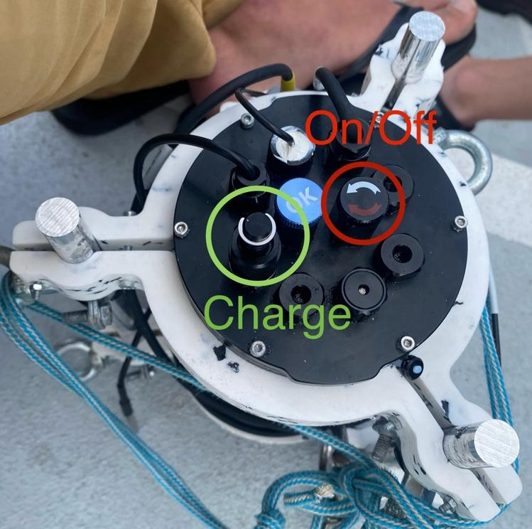

# Quick guide

## Turn on the CTD
The CTD can be turned on by closing (turning clockwise) the on/off switch as marked in the image below.

## Connect to the CTD
The CTD will start after turning on the power supply. Please note that this might take up to one minute.
A Wi-Fi network called `CTD` will then appear. Connect to it with the password `CTDCTDCTD`.

For further settings and system upgrades, it is possible to connect over SSH `ssh ctd@192.168.42.1` and password `ctd`.

## Start a recording
To start a CTD recording, use the web-interface, and open the URL: [http://192.168.42.1/run?run_type=0](http://192.168.42.1/run?run_type=0)
This recording will run until it is stopped or the Raspberry Pi turned off.

It's also possible to start a recording which automatically stops after a specified amount of seconds: [http://192.168.42.1/run?run_type=1&run_data=60](http://192.168.42.1/run?run_type=1&run_data=60)
Change the number after `run_data=` to change the duration that is measured.

After starting the run over the webpage, a number is returned. This is the so called run-id. Note it down.

## Stop a recording
To stop a specific run, stop it with the corresponding run-id: [http://192.168.42.1/stop?run_id=0](http://192.168.42.1/stop?run_id=0).

Adapt the number after `run_id=` accordingly.

It is also possible to view all runs over [http://192.168.42.1/runs](http://192.168.42.1/runs)

## Download data
To download the recorded data as a CSV-file, open the following URL: [http://192.168.42.1/csv](http://192.168.42.1/csv)

To download the data from a specified run-only, append the `run_id` parameter: [http://192.168.42.1/csv?run_id=0](http://192.168.42.1/csv?run_id=0)

